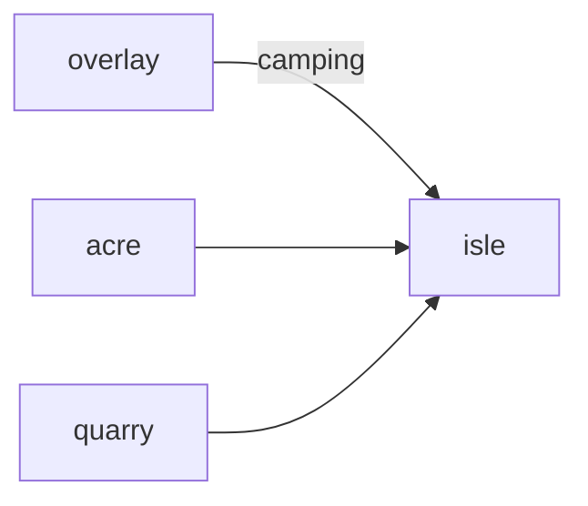

# Isle

**Pet Survival Island** — Open-world craft-survival driven by what your pets can actually do.

Part of [ComputerPets](https://github.com/RicheyWorks/computerpets). Map: [computerpets-ecosystem](https://github.com/RicheyWorks/computerpets-ecosystem).

| | |
| --- | --- |
| Status | Design scaffold — loop and engine frozen |
| License | MIT |
| Tokens | Minigames never mint or burn. Tired overlay, not a dead lineage. |
| First pet | [Meet Rui first](https://github.com/RicheyWorks/computerpets/blob/main/docs/START-HERE.md). This game is optional. |

## The loop

You are not a naked human. Rui climbs, Paint scouts water, Reed clears bugs. Isle is a long session; overlay pets used here are 'camping' and hidden on the desktop.

## Who plays

Long-session players. Overlay pets are 'camping' and hidden on the desktop.

## What it is not

Default PvP. Not a human-survivor sim — pets are the tools.

## Genre and engine

- Genre: **Open-world survival**
- Engine: **Unreal Engine**
- Stack: Unreal Engine 5 · craft/survival · pet abilities as tools · optional dedicated server
- Default surface: `7777`

## Architecture



## How you play

1. Drop on a canon-biome island.
2. Assign pets as tools (dig, fish, watch).
3. Night = sleep care or mood drop.
4. Extract = bring craft unlocks home, not a new species.

## First slice

Build this and stop.

**Drop, assign Rui as climber, extract a craft unlock, auto-recall 15m on quit.**

You know it works when: Quit without extract: auto-recall. Server crash: local snapshot. PvP off.

## Environment

UE5

## Failure doctrine

Pet leftover on island after quit → auto-recall 15m. Dedicated server crash → local snapshot. PvP off by default.

Canon rules that never yield:

- 210 living kinds. No illegal hybrids.
- Overlay pets can get tired, sick, or hide. Tokens are not burned by a minigame.
- Desktop walk stays the main quest. Closing Isle must leave Rui walking.

## Neighbors

- computerpets-hearth (camp)
- computerpets-acre
- computerpets-quarry
- computerpets-visitation
- computerpets-lore

## Layout

```
computerpets-isle/
  README.md
  LICENSE
  docs/DESIGN.md
  src/                implementation lands here
```

## Run (Windows)

```powershell
UE5: open Isle.uproject. Server: IsleServer.exe -port=7777
```

Meet Rui first via the [flagship start-here](https://github.com/RicheyWorks/computerpets/blob/main/docs/START-HERE.md). This game is optional.

## Links

- Flagship: [RicheyWorks/computerpets](https://github.com/RicheyWorks/computerpets)
- This repo: [RicheyWorks/computerpets-isle](https://github.com/RicheyWorks/computerpets-isle)
- Map: [RicheyWorks/computerpets-ecosystem](https://github.com/RicheyWorks/computerpets-ecosystem)
- Design file: [docs/DESIGN.md](docs/DESIGN.md)

## License

MIT. See [LICENSE](LICENSE).

---

*Two hundred ten living kinds. Keep them so a line does not go quiet.*
