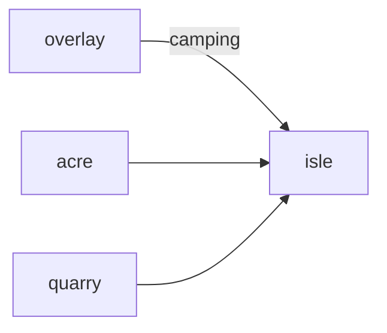

# Isle

**Pet Survival Island** — A planned island survival game where pet abilities become tools for exploration and crafting.

Part of [ComputerPets](https://github.com/RicheyWorks/computerpets). Map: [computerpets-ecosystem](https://github.com/RicheyWorks/computerpets-ecosystem).

[Status](#status) · [Design](docs/DESIGN.md) · [Contributor start](#contributor-start) · [Ecosystem](https://github.com/RicheyWorks/computerpets-ecosystem)

| Project | At a glance |
| --- | --- |
| Status | Design scaffold; not runnable yet |
| License | MIT |
| Tokens | Minigames never mint or burn. Tired overlay, not a dead lineage. |
| First pet | [Flagship start guide](https://github.com/RicheyWorks/computerpets/blob/main/docs/START-HERE.md) |

## Status

This repository contains a [design](docs/DESIGN.md) and a [source placeholder](src/README.txt). It has no runnable application, build manifest, automated tests, or CI workflow.

The experience, interfaces, integrations, and safeguards below are **implementation plans**, not supported features. The first implementation slice defines the initial contribution target.

## Planned experience

You are not a naked human. Rui climbs, Paint scouts water, Reed clears bugs. Isle is a long session; overlay pets used here are 'camping' and hidden on the desktop.

## Intended audience

Long-session players. Overlay pets are 'camping' and hidden on the desktop.

## Out of scope

Default PvP. Not a human-survivor sim — pets are the tools.

## Planned genre and engine

- Genre: **Open-world survival**
- Engine: **Unreal Engine**
- Stack: Unreal Engine 5 · craft/survival · pet abilities as tools · optional dedicated server
- Proposed surface: `7777`

## Proposed integration



## Proposed play loop

1. Drop on a canon-biome island.
2. Assign pets as tools (dig, fish, watch).
3. Night = sleep care or mood drop.
4. Extract = bring craft unlocks home, not a new species.

## First implementation slice

Initial implementation target:

**Drop, assign Rui as climber, extract a craft unlock, auto-recall 15m on quit.**

Acceptance targets: Quit without extract: auto-recall. Server crash: local snapshot. PvP off.

## Planned environment

UE5

## Planned safeguards

Pet leftover on island after quit → auto-recall 15m. Dedicated server crash → local snapshot. PvP off by default.

Design constraints:

- 210 living kinds. No illegal hybrids.
- Overlay pets can get tired, sick, or hide. Tokens are not burned by a minigame.
- Desktop walk stays the main quest. Closing Isle must leave Rui walking.

## Related projects

- [computerpets-hearth](https://github.com/RicheyWorks/computerpets-hearth) (camp)
- [computerpets-acre](https://github.com/RicheyWorks/computerpets-acre)
- [computerpets-quarry](https://github.com/RicheyWorks/computerpets-quarry)
- [computerpets-visitation](https://github.com/RicheyWorks/computerpets-visitation)
- [computerpets-lore](https://github.com/RicheyWorks/computerpets-lore)

## Layout

```
computerpets-isle/
  README.md
  LICENSE
  docs/DESIGN.md
  src/                implementation lands here
```

## Contributor start

With Git and PowerShell, clone the scaffold and read its design and source marker:

```powershell
git clone https://github.com/RicheyWorks/computerpets-isle.git
Set-Location computerpets-isle
Get-Content .\docs\DESIGN.md
Get-Content .\src\README.txt
```

Start with the [first implementation slice](#first-implementation-slice). Add the minimum project setup and tests needed for that slice, then document verified run commands. The proposed stack above is a design choice; there is no install or launch command for this checkout yet.

## Links

- Flagship: [RicheyWorks/computerpets](https://github.com/RicheyWorks/computerpets)
- This repo: [RicheyWorks/computerpets-isle](https://github.com/RicheyWorks/computerpets-isle)
- Map: [RicheyWorks/computerpets-ecosystem](https://github.com/RicheyWorks/computerpets-ecosystem)
- Design file: [docs/DESIGN.md](docs/DESIGN.md)

## License

MIT. See [LICENSE](LICENSE).

---

*Two hundred ten living kinds. Keep them so a line does not go quiet.*
